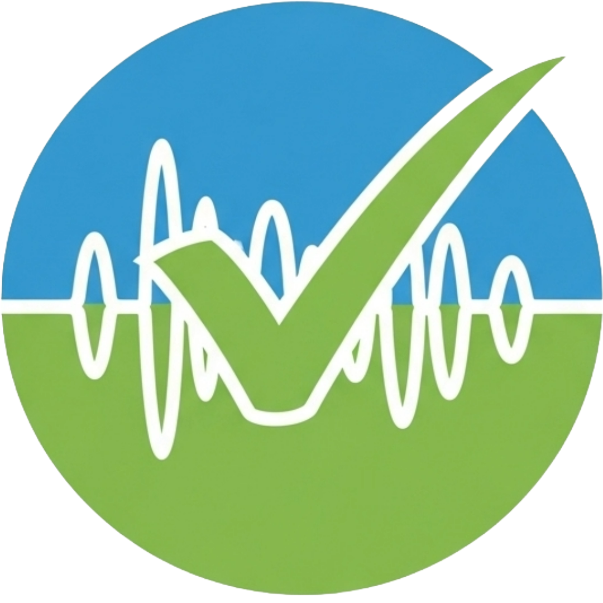
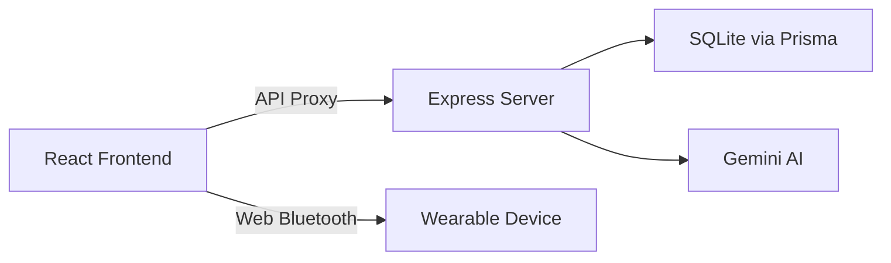

<p align="center">
  
</p>

<h1 align="center">SafeSignal</h1>
<p align="center"><strong>Sense safety before you think it.</strong></p>
<p align="center">Track your body's pre-conscious sense of safety vs danger and recover before overload.</p>

---

SafeSignal is a **speculative near-future wellness platform** that tracks **neuroception** — the body's pre-conscious sense of safety vs danger — and helps users detect unsafe nervous-system states earlier, intervening with subtle environmental adjustments before panic, dissociation, or shutdown.

## Architecture



### Data Flow

```
Wearable / Simulation ──▶ Sensor Reading ──▶ Neuroception Engine ──▶ State (Safe/Guarded/Overloaded)
                                                    │
                                                    ▼
                                         Interventions + AI Insights
                                                    │
                                                    ▼
                                          SQLite DB (per user)
```

### Server (Express + TypeScript + Prisma)
| Component | Files | Purpose |
|-----------|-------|---------|
| Auth | `auth.service.ts`, `auth.routes.ts` | JWT + bcrypt, register/login |
| Neuroception | `neuroception.service.ts`, `session.routes.ts` | 6-sensor scoring engine, sessions |
| AI | `gemini.service.ts`, `insight.routes.ts` | Gemini insights with fallback |
| Middleware | `auth.middleware.ts`, `error.middleware.ts` | JWT verification, error handling |
| Database | `schema.prisma` | User, Session, SensorReading, Intervention, DailyReflection |

### Client (Vite + React 19 + TypeScript)
| Page | Key Features |
|------|-------------|
| LandingPage | Animated halo, use case tabs, safeguards |
| AuthPage | Login/signup with JWT |
| DashboardPage | Live sensors, body halo, wearable, interventions |
| ReflectionPage | Timeline, AI insights |
| ProfilePage | Settings, safeguards |

| Component | Purpose |
|-----------|---------|
| WearablePicker | Branded device selector modal |
| useWearable | Web Bluetooth API hook |
| Layout | Responsive navbar + mobile drawer |

## Key Features

### Real-Time Neuroception Engine
- Monitors **6 micro-signals**: breath pace, jaw tension, posture collapse, skin conductance, voice strain, motion restlessness
- **Weighted scoring algorithm** computes nervous system state with confidence percentage
- **3-state model**: Safe → Guarded → Overloaded with animated body-map halo visualization

### Wearable Device Integration
- **Branded device picker** supporting popular wearables:
  - Apple Watch, Fitbit, Garmin, Samsung Watch, Mi Band/Amazfit
  - Plus health apps: Google Fit, Fitbit App, Apple Health, Samsung Health
- **Web Bluetooth API** connects to BLE heart rate monitors
- Derives neuroception signals from real heart rate + HRV data
- **Automatic fallback** to simulated data when no device is connected

### Guided Recovery & Interventions
- Grounding haptic pulses from wearable
- Quiet route suggestions (less crowded paths)
- Non-essential alert suppression
- **60-second micro-reset** with guided breathing

### Daily Reflection & AI Insights
- **Window-of-tolerance timeline** showing which moments drained or restored you
- **Gemini AI-powered** personalized insights, recommendations, and encouragement
- Activity breakdown with state tracking per time block

### Privacy-First Safeguards
| Safeguard | Description |
|-----------|-------------|
| Consent-first sensing | No passive monitoring of others |
| Private by default | All data encrypted on-device |
| No truth claims | Confidence-based language only |
| Manual override | Mute all interventions instantly |
| Emergency mode | Grounding + trusted-contact alerts |
| Anti-misuse | No employer/school/partner access |

### Premium Design
- **Glassmorphism UI** with dark/light mode
- **Mobile-responsive** with hamburger menu and slide-in drawer
- **Sound effects** (click, send, received) with toggle
- Smooth animations and micro-interactions throughout

## Tech Stack

| Layer | Technology |
|-------|-----------|
| **Frontend** | React 19, TypeScript, Vite, Zustand, React Query, CSS Modules |
| **Backend** | Node.js, Express, Prisma ORM, SQLite |
| **AI** | Google Gemini API (with intelligent fallback) |
| **Hardware** | Web Bluetooth API (BLE Heart Rate Profile) |
| **Security** | Helmet, CORS, Rate Limiting, Compression, bcrypt, JWT |

## Getting Started

### Prerequisites
- Node.js 18+
- npm

### Installation & Setup

```bash
# 1. Clone the repository
git clone https://github.com/ritikiitg/SafeSignal.git
cd SafeSignal

# 2. Setup the server
cd server
npm install
cp .env.example .env    # Edit with your own JWT_SECRET
npx prisma db push

# 3. Setup the client
cd ../client
npm install
```

### Running Locally

```bash
# Terminal 1 — Start the API server
cd server
npm run dev    # Runs on http://localhost:3001

# Terminal 2 — Start the frontend
cd client
npm run dev    # Runs on http://localhost:5173
```

Open **http://localhost:5173** in your browser.

## Project Structure

```
SafeSignal/
├── client/                         # React 19 + TypeScript + Vite
│   ├── public/assets/              # Logos, sound effects
│   │   ├── logo_favi.png           # App favicon/nav logo
│   │   ├── click.wav               # UI click sound
│   │   ├── send.wav                # Send action sound
│   │   └── received.wav            # State change sound
│   └── src/
│       ├── components/
│       │   ├── layout/             # Layout.tsx — Navbar, mobile drawer
│       │   └── wearable/           # WearablePicker.tsx — Device selector
│       ├── hooks/
│       │   ├── useSound.ts         # Audio feedback hook
│       │   └── useWearable.ts      # Web Bluetooth integration
│       ├── pages/
│       │   ├── LandingPage.tsx     # Hero, use cases, safeguards
│       │   ├── AuthPage.tsx        # Login / Register
│       │   ├── DashboardPage.tsx   # Live detection + interventions
│       │   ├── ReflectionPage.tsx  # Daily timeline + AI insights
│       │   └── ProfilePage.tsx     # Settings + preferences
│       ├── services/api.ts         # API client with JWT
│       ├── stores/                 # Zustand (auth + neuroception)
│       └── index.css               # Design system + glassmorphism
│
├── server/                         # Express + TypeScript + Prisma
│   ├── prisma/schema.prisma        # Database models
│   └── src/
│       ├── routes/                 # auth, user, sessions, insights
│       ├── services/
│       │   ├── auth.service.ts     # JWT + bcrypt authentication
│       │   ├── neuroception.service.ts  # State engine + scoring
│       │   └── gemini.service.ts   # AI insights with fallback
│       ├── middleware/             # Auth + error handling
│       └── index.ts               # Express app entry
│
├── idea.txt                        # Product concept
├── walkthrough.md                  # Build walkthrough & verification
└── README.md
```

## Neuroception Engine

SafeSignal uses a **weighted scoring algorithm** to compute nervous-system state from 6 body signals:

| Signal | Weight | Source |
|--------|--------|--------|
| Breath pace | 20% | Wearable HRV / Simulated |
| Skin conductance | 20% | Wearable HR / Simulated |
| Jaw tension | 18% | Camera / Estimated |
| Posture collapse | 15% | IMU / Estimated |
| Voice strain | 15% | Microphone / Estimated |
| Motion restlessness | 12% | Wearable accelerometer / Simulated |

**State thresholds:**
- **Safe** (score 0–30): Body is open and regulated
- **Guarded** (score 30–65): Early stress signals detected
- **Overloaded** (score 65+): System approaching or in overload

## Environment Variables

### Server (`/server/.env`)

| Variable | Description | Default |
|----------|-------------|---------|
| `PORT` | Server port | 3001 |
| `DATABASE_URL` | SQLite database path | `file:./dev.db` |
| `JWT_SECRET` | JWT signing secret | (required) |
| `JWT_EXPIRES_IN` | Token expiration | 7d |
| `GEMINI_API_KEY` | Google Gemini API key | (optional) |

## Three Use Cases

### 1. Commute Overload
Ritika enters a packed train. SafeSignal detects rising threat response before she notices. Wearable sends a grounding pulse; app suggests a calmer exit.
> **Outcome:** Overload prevented before panic peaks.

### 2. Stressful Meeting
During a meeting, voice flattens and posture tightens. SafeSignal drops from Safe to Guarded. It delays notifications and activates breath pacing.
> **Outcome:** She stays present instead of shutting down.

### 3. End-of-Day Reflection
Ritika reviews her daily window-of-tolerance timeline. She sees which moments drained her and which restored her. The app recommends behavior changes.
> **Outcome:** Stronger self-understanding and better planning.

## Build Verification

| Check | Result |
|-------|--------|
| Client `vite build` | ✅ 109 modules, 0 errors, 1.30s |
| Server runs | ✅ Port 3001, Helmet + Rate Limiting + Compression |
| Client dev server | ✅ Vite 7.3.1, HMR active |
| npm install (client) | ✅ 76 packages, 0 vulnerabilities |
| npm install (server) | ✅ 278 packages |
| Prisma DB push | ✅ SQLite database ready |

## Future Roadmap

- [ ] Real-time camera-based jaw tension detection
- [ ] Native mobile app (React Native)
- [ ] Apple HealthKit & Google Health Connect server-side API integration
- [ ] Group session mode for therapists
- [ ] Export data to PDF for clinical use
- [ ] Multi-language support

## License

Built for the **Devpost Hackathon 2026**

---

<p align="center"><em>Powered by Google Gemini · Built with React + Express + Prisma</em></p>
